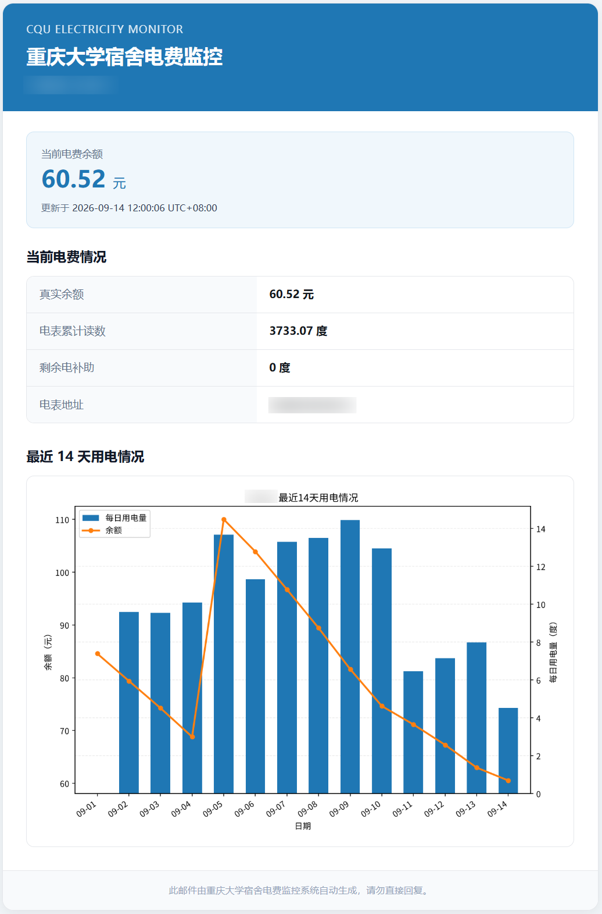

# 重庆大学宿舍电费监控（虎溪）

使用重庆大学缴费平台令牌，定时抓取宿舍电费余额和电表累计读数，可生成用电图表，并通过 SMTP 邮件定时发送当前电费情况。



## 配置文件

复制 `.env.example` 为 `.env` 后进行编辑。完整配置和说明见 [.env.example](.env.example)，核心配置为：

```dotenv
SYNJONES_AUTH=access_token
CQU_ROOM=D1102
CQU_BUILDING=兰园1栋
SCHEDULE_TIME=12:00            # 每日抓取时间
EMAIL_ENABLED=true             # 电费邮件通知
BALANCE_WARNING_ENABLED=true   # 余额不足警告
```

## 获取 Token

1. 在桌面端浏览器打开[缴费大厅](http://payment.cqu.edu.cn/plat/shouyeUser)，完成统一认证登录。
2. 按 F12 启动浏览器开发者工具，在控制台（Console）中执行 `sessionStorage.getItem('access_token')`，复制输出的令牌内容。
3. 将令牌填入 `.env` 的 `SYNJONES_AUTH` 即可，令牌过期后需重新获取，当前系统设置的有效期为两个月。

## 直接运行

本项目基于 Python 3，安装依赖：

```bash
pip install -r requirements.txt
```

运行方式：

```bash
python -m cqu_electricity once   # 单次抓取并追加到 history.csv
python -m cqu_electricity daemon # 按 .env 中的每日抓取和每周邮件计划持续运行
python -m cqu_electricity plot   # 根据 history.csv 生成图表 history.png
python -m cqu_electricity email  # 使用 history.csv 最新记录生成图表并立即发送邮件
```

## 容器运行

构建镜像：

```bash
docker build -t cqu-electricity-bill .
```

启动容器，环境变量的内容与 `.env` 文件一致：

```bash
docker run -d \
  --name cqu-electricity-bill \
  --restart unless-stopped \
  -e ... \
  -v "${PWD}/data:/data" \
  cqu-electricity-bill
```
